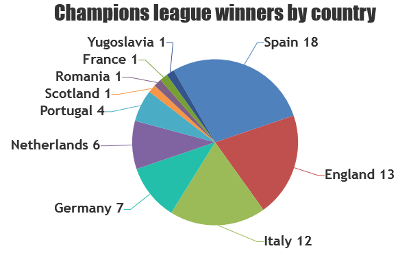

# champions-league-winners

**According to wikipedia:**
[Champions League](https://en.wikipedia.org/wiki/UEFA_Champions_League) or UEFA Champions League is  is an annual club football competition organised by the Union of European Football Associations (UEFA). Real Madrid is the most successful club in the tournament's history.

In this repo we provide a json file. The json file contains data about all clubs, those won the champions league. We use [`canvasjs`](https://canvasjs.com/) to visualize the data.

## Json File

```json
[
    {
        "name": "Real Madrid",
        "founded": "1902",
        "won": 13,
        "country": "Spain"
    },
    {
        "name": "AC Milan",
        "founded": "1899",
        "won": 7,
        "country": "Italy"
    },
    ...
]
```
## JS charts with canvasjs

Here a diagram that shows number of victories by countries:
Clubs from spain have the highest number of victories


